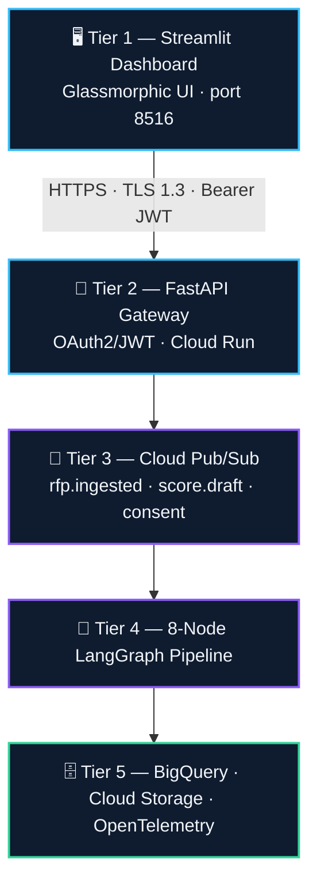

<div align="center">

# 🧠 VendorMind AI
### Enterprise Procurement Intelligence Platform

**Stateful 8-Agent LangGraph Pipeline · Gemma 3 27B-IT Edge Privacy Gate · Google A2A Protocol · Decoupled Cloud Pub/Sub Microservices**

[](https://hidevs.ai)
[](https://hidevs.ai)
[](https://github.com/vinaybabannavar-create/VendorMind-AI)
[](./LICENSE)

[](https://www.python.org/)
[](https://fastapi.tiangolo.com/)
[](https://streamlit.io/)
[](https://www.langchain.com/langgraph)
[](https://ai.google.dev/)
[](https://cloud.google.com/run)

</div>

---

## 📑 Table of Contents

- [Executive Overview](#-executive-overview)
- [Why VendorMind AI](#-why-vendormind-ai)
- [10/10 Mandatory Hackathon Stack Architecture](#-1010-mandatory-hackathon-stack-architecture)
- [System Architecture](#-system-architecture)
- [8-Node Agentic Pipeline](#-8-node-agentic-pipeline)
- [Multi-Signal Scoring Model](#-multi-signal-scoring-model)
- [Security, Privacy & Regulatory Compliance](#-security-privacy--regulatory-compliance)
- [IEEE 830 SRS Traceability Matrix](#-ieee-830-srs-traceability-matrix)
- [UI & Dashboard Experience](#-ui--dashboard-experience)
- [Quick Start & Local Run Guide](#-quick-start--local-run-guide)
- [Key Project Documentation](#-key-project-documentation)

---

## 🚀 Executive Overview

**VendorMind AI** is an enterprise-grade AI procurement platform designed to transform slow, manual, spreadsheet-based Request for Proposal (RFP) evaluations into **explainable, compliant, and multi-signal AI decisions**.

Engineered with an **8-node stateful agentic graph (LangGraph)**, **Google Cloud Pub/Sub decoupled microservices**, and **Gemma 3 27B-IT edge privacy filtering**, VendorMind AI evaluates complex RFP requirements against multi-vendor proposals in **under 45 seconds** — while guaranteeing strict **GDPR Article 5/13/14 privacy**, **EEOC 4/5ths Rule bias mitigation**, and **OWASP Top 10 API security**.

<div align="center">

| ⚡ Speed | 🧩 Explainability | 🛡️ Compliance | ⚖️ Fairness |
|:---:|:---:|:---:|:---:|
| < 45s per evaluation | 3-sentence CRISPE justification per vendor | GDPR Art. 5/13/14/17/22 | EEOC 4/5ths Rule enforced |

</div>

---

## 🎯 Why VendorMind AI

| | Traditional Procurement Workflow | VendorMind AI |
|:---|:---|:---|
| **Evaluation method** | Manual spreadsheet scoring, inconsistent criteria between reviewers | 4-signal weighted composite scoring, applied identically every run |
| **Decision rationale** | "Gut feel" notes, rarely documented | CRISPE-structured, human-readable justification per vendor |
| **Bias detection** | Not checked, or checked manually after the fact | EEOC 4/5ths Adverse Impact Ratio enforced automatically pre-decision |
| **Compliance paperwork** | Handled separately by legal/procurement ops | GDPR Art. 13/14 consent & disclosure generated inline with evaluation |
| **Audit trail** | Email threads and static spreadsheets | Immutable BigQuery log of every score, flag, and approval |
| **Turnaround** | Days, for a multi-vendor RFP | Under 45 seconds per evaluation |

---

## 🏆 10/10 Mandatory Hackathon Stack Architecture

<div align="center">

| Mandatory Stack Component | Architectural Role & Implementation |
|:---|:---|
| **Google AI Studio** | Primary API gateway endpoint for deep qualitative LLM reasoning. |
| **Gemini 1.5 Pro** | Core reasoning LLM for Criteria Extraction, Risk Analysis, and Explanation Generation. |
| **Gemma 3 27B-IT** | On-device lightweight model executing **edge PII redaction** at Node 1 (GDPR Article 5). |
| **Antigravity (AGY)** | AI-assisted development layer managing stateful graph transitions & 12-Factor App standards. |
| **Google ADK** | Agent Development Kit for structured agent scaffolding and tool registration. |
| **MCP (Model Context Protocol)** | Context injection & tool grounding for Gemini during criteria extraction. |
| **A2A Protocol** | Google's Agent-to-Agent spec for direct, decentralised Scoring ↔ Risk negotiation. |
| **Vertex AI** | Managed model serving, Vertex AI Vector Search (knowledge base), and Gemma hosting. |
| **Cloud Run** | 12-Factor App serverless container hosting for FastAPI gateway & Streamlit UI. |
| **BigQuery** | Immutable Audit & State Store (90-day TTL, complete A2A message logs, HITL decisions). |

</div>

---

## 📐 System Architecture

Five tiers, client to storage — rendered live below with [Mermaid](https://mermaid.js.org/), so it displays natively on GitHub with no external image dependency.



---

## 🤖 8-Node Agentic Pipeline

```mermaid
flowchart LR
    N1["1️⃣ Intake & Privacy\nGemma 3 27B-IT"] --> N2["2️⃣ Criteria Extraction\nGemini 1.5 Pro + MCP"]
    N2 --> N3["3️⃣ Profile Retrieval\nVertex AI Vector Search"]
    N3 --> N4["4️⃣ Multi-Signal Scoring\nCost · Compliance · Fit · Timeline"]
    N4 <-->|"A2A handshake\nscore_draft ⇄ risk_veto"| N5["5️⃣ Risk & Bias Detection\nEnkrypt AI · EEOC 4/5ths"]
    N5 --> N6["6️⃣ Explanation Gen\nGemini 1.5 Pro CRISPE"]
    N6 --> N7["7️⃣ Comparison Agent\nPandas ranked matrix"]
    N7 --> N8["8️⃣ Output & HITL\nOfficer approval"]

    style N1 fill:#0F1B2E,stroke:#38BDF8,stroke-width:2px,color:#F1F5F9
    style N2 fill:#0F1B2E,stroke:#38BDF8,stroke-width:2px,color:#F1F5F9
    style N3 fill:#0F1B2E,stroke:#5EEAD4,stroke-width:2px,color:#F1F5F9
    style N4 fill:#0F1B2E,stroke:#5EEAD4,stroke-width:2px,color:#F1F5F9
    style N5 fill:#0F1B2E,stroke:#A78BFA,stroke-width:2px,color:#F1F5F9
    style N6 fill:#0F1B2E,stroke:#A78BFA,stroke-width:2px,color:#F1F5F9
    style N7 fill:#0F1B2E,stroke:#34D399,stroke-width:2px,color:#F1F5F9
    style N8 fill:#0F1B2E,stroke:#34D399,stroke-width:2px,color:#F1F5F9
```



<div align="center">

| # | Agent | Powered By | What It Does | State Output |
|:---:|:---|:---|:---|:---|
| 1 | **Intake & Privacy** | Gemma 3 27B-IT | Ingests PDF/TXT/DOCX/JSON RFP & vendor docs; redacts PII (SSNs, emails, phones, addresses) on-device before any cloud call — GDPR Art. 5 | `parsed_rfp`, `parsed_vendors` |
| 2 | **Criteria Extraction** | Gemini 1.5 Pro + MCP | Extracts explicit & implicit RFP criteria; flags restrictive phrasing that could bias against SME/minority vendors | `criteria_dict` |
| 3 | **Profile Retrieval** | Vertex AI Vector Search / Qdrant | Queries historical vendor performance via `sentence-transformers/all-MiniLM-L6-v2` | `vendor_context` |
| 4 | **Multi-Signal Scoring** | Python + A2A Protocol | Computes weighted composite: cost, compliance/SLA, semantic fit, timeline; opens A2A handshake with Node 5 | `score_draft` |
| 5 | **Risk & Bias Detection** | Enkrypt AI + EEOC 4/5ths Rule | Vetoes/adjusts scores where Adverse Impact Ratio < 0.80; Enkrypt AI toxicity scan on risk narrative | `risk_flags`, `eeoc_report`, `a2a_log` |
| 6 | **Explanation Generation** | Gemini 1.5 Pro (CRISPE) | 3-sentence human-readable justification per vendor — EU AI Act Art. 13 | `explanations` |
| 7 | **Comparison** | Python + Pandas | Side-by-side ranked matrix with EEOC adjustment flags and A2A veto counts | `comparison_table` |
| 8 | **Output & HITL** | — | Procurement officer approval gate; HTML audit report; Web Speech API voice summary | Final decision → BigQuery |

</div>

---

## 📊 Multi-Signal Scoring Model

<div align="center">

| Signal | Weight | Source | What It Rewards |
|:---|:---:|:---|:---|
| 💰 Cost Competitiveness | 40% | Extracted bid price vs. cheapest vendor | Lower, well-justified pricing |
| 🛡️ Compliance & SLA Completeness | 36%* | Required cert/SLA coverage | Full documentation, no missing certs |
| 🔍 Semantic Capability Fit | 24%* | Vector similarity, vendor profile ↔ RFP | Genuine capability match, not keyword stuffing |
| ⏱️ Delivery Timeline Alignment | Modifier | Proposed vs. required delivery window | Realistic, on-time delivery commitments |

<sub>*Compliance and Semantic Fit split the remaining weight 60/40 after the cost weight is applied.</sub>

</div>

---

## 🔒 Security, Privacy & Regulatory Compliance

<div align="center">

| Framework | Article / Control | Implementation |
|:---|:---|:---|
| GDPR | Art. 5 — Data Minimisation | Gemma 3 27B-IT redacts PII before cloud LLM transmission |
| GDPR | Art. 13 — Consent Capture | Explicit opt-in via `POST /v1/consent` |
| GDPR | Art. 14 — Transparency | Automated disclosure emails to vendor DPOs |
| GDPR | Art. 17 — Right to Erasure | BigQuery 90-day automatic retention TTL |
| GDPR | Art. 22 — Automated Decision Rights | Node 8 HITL human approval gate |
| EEOC | 4/5ths Rule | A2A Scoring ↔ Risk negotiation monitors Adverse Impact Ratio; auto fairness floor below 0.80 |
| OWASP | A01 Broken Access Control | OAuth2 Bearer / JWT (`POST /token`) |
| OWASP | A02 Cryptographic Failures | TLS 1.3 in transit, AES-256 at rest |
| OWASP | A03 Injection | Pydantic v2 strict schema validation, XSS sanitization |
| OWASP | A07 Rate Limiting | 100 requests/min/IP, in-process |
| Observability | OpenTelemetry | Per-node latency & token counts via `GET /evaluation/{id}/telemetry` |

</div>

---

## 📋 IEEE 830 SRS Traceability Matrix

<div align="center">

| Requirement ID | Component | Implementation File | Acceptance / Verification Metric |
|:---|:---|:---|:---|
| **FR-101** | Node 1 (Intake) | [`pipeline/gemma_filter.py`](./pipeline/gemma_filter.py) | 100% PII scrubbed via Gemma 3 27B-IT before egress |
| **FR-102** | GDPR Consent Engine | [`pipeline/gdpr_consent.py`](./pipeline/gdpr_consent.py) | Consent logged via `/v1/consent` & Art. 14 email dispatched |
| **FR-103** | Node 2 (Criteria) | [`pipeline/criteria_agent.py`](./pipeline/criteria_agent.py) | Gemini 1.5 Pro + MCP extracts validated criteria JSON |
| **FR-104** | Node 3 (Retrieval) | [`pipeline/retrieval_agent.py`](./pipeline/retrieval_agent.py) | Vertex Vector Search semantic similarity > 0.65 |
| **FR-105, 106** | Nodes 4 & 5 (A2A) | [`pipeline/a2a_protocol.py`](./pipeline/a2a_protocol.py) | A2A 3-step handshake; AIR < 0.80 triggers veto |
| **FR-107** | Node 6 (Explanation) | [`pipeline/explanation_agent.py`](./pipeline/explanation_agent.py) | EU AI Act Art. 13 compliant 3-sentence justification |
| **FR-108** | Node 7 (Comparison) | [`pipeline/comparison_agent.py`](./pipeline/comparison_agent.py) | Ranked side-by-side Pandas DataFrame |
| **FR-109** | Node 8 (HITL) | [`api/main.py`](./api/main.py) | Human approval recorded in BigQuery audit log |
| **FR-110** | Event Bus Decoupler | [`pipeline/pubsub_eventbus.py`](./pipeline/pubsub_eventbus.py) | Async event dispatch on Cloud Pub/Sub topics |
| **NFR-201** | Security (Auth) | [`api/main.py`](./api/main.py) | OAuth2 JWT token verification on all protected routes |
| **NFR-202** | Security (Encryption) | GCP Cloud Infrastructure | TLS 1.3 transit & AES-256 rest headers verified |
| **NFR-203** | Rate Limiting | [`api/main.py`](./api/main.py) | 101st request per minute returns HTTP 429 |
| **NFR-205** | Observability | `GET /evaluation/{id}/telemetry` | Returns OpenTelemetry latency & trace payload |

</div>

---

## 🎨 UI & Dashboard Experience

VendorMind AI features a **Futuristic Glassmorphic Interface** built in Streamlit:

<div align="center">

| Feature | Description |
|:---|:---|
| 🟢 Live AI Control Center | Real-time telemetry badges for Gemma 3 27B-IT, Gemini 1.5 Pro, and A2A Protocol |
| 🥊 1-v-1 Cyber Duel | Head-to-head battle card comparison tab for shortlisted candidates |
| 🛡️ Enkrypt AI Safety Badges | Visual indicators for real-time toxicity and fairness auditing |
| 🔊 Voice Briefing Engine | Integrated Web Speech API button generating verbal executive summaries |
| 📄 Executive Audit Report | One-click download of print-ready HTML procurement audit reports |

</div>

---

## ⚡ Quick Start & Local Run Guide

### Option A — Docker (recommended)

```bash
git clone https://github.com/vinaybabannavar-create/VendorMind-AI.git
cd VendorMind-AI
docker build -t vendormind-ai .
docker run -p 8501:8501 --env-file .env vendormind-ai
```
> Runs the FastAPI backend (internal, port 8000) and the Streamlit dashboard (public, port 8501) in one container via `start.sh`.

### Option B — Manual, two terminals

**1. Clone & install**
```bash
git clone https://github.com/vinaybabannavar-create/VendorMind-AI.git
cd VendorMind-AI
pip install -r requirements.txt
```

**2. Configure environment variables**

Copy `.env.example` to `.env` and set your API keys:
```bash
GEMINI_API_KEY="your-google-ai-studio-key"
ENKRYPT_API_KEY="your-enkrypt-key-optional"
```

**3. Launch the FastAPI backend** — Terminal 1
```bash
python -m uvicorn api.main:app --host 127.0.0.1 --port 8080 --reload
```
> API docs at `http://127.0.0.1:8080/docs`

**4. Launch the Streamlit dashboard** — Terminal 2
```bash
$env:API_BASE_URL="http://127.0.0.1:8080"
python -m streamlit run ui/app.py --server.port 8516
```
> Open `http://localhost:8516` in your browser to launch VendorMind AI.

---

## 📄 Key Project Documentation

<div align="center">

| Document | Description |
|:---|:---|
| 📘 [`PRD.md`](./PRD.md) | Formal IEEE 830 SRS Product Requirements Document |
| 📐 [`ARCHITECTURE.md`](./ARCHITECTURE.md) | Architectural Specifications & Node Contracts |
| 📜 [`LICENSE`](./LICENSE) | MIT Open Source License |

</div>

---

<div align="center">

**VendorMind AI** · Built for the **HiDevs National AI Hackathon 2026**
*Powered by Google AI Studio · Gemini 1.5 Pro · Gemma 3 27B-IT · LangGraph · Cloud Pub/Sub · Cloud Run*

</div>
